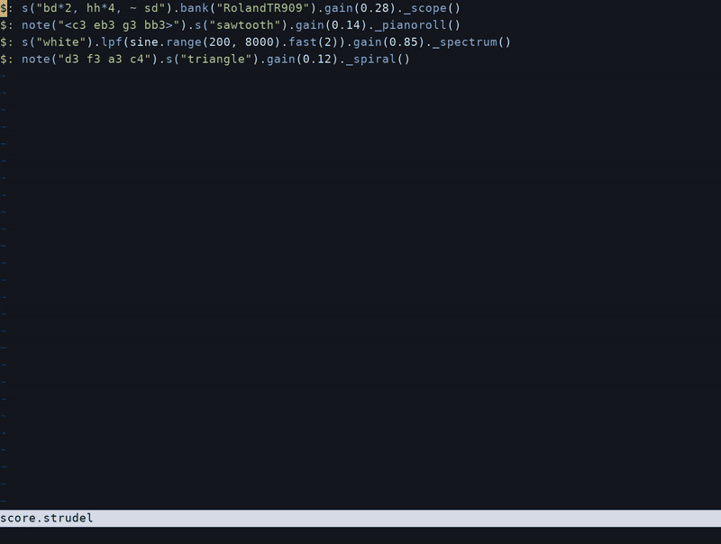

# Rustel for Neovim

Play [Strudel](https://strudel.cc)/[Rustel](https://rustel.cc) scores in Neovim, with syntax colors, active notes, and inline visuals.
Requires Neovim 0.9 or later and a current [rustel](https://github.com/tzfm/rustel) binary on your PATH.
No other Neovim plugins are needed.



## Install

Add this to your lazy.nvim plugins. It loads the `rustel` module with the default settings:

```lua
{
  "tzfm/rustel-neovim",
  main = "rustel",
  lazy = false,
  opts = {},
}
```

## Default keys

Open a `.strudel` or `.rustel` file and press `Ctrl-S` to save and start playing.
These keys work in normal mode and in insert mode.

| Key | Action |
| --- | --- |
| `Ctrl-Enter` / `Ctrl-S` | Save and update, or start playback |
| `Ctrl-G` / `Ctrl-.` | Let the tail finish. Press again to cut it. |

`Ctrl-Enter` and `Ctrl-.` need support from the terminal.
If `Ctrl-S` freezes the terminal, run `stty -ixon` in the shell before you start Neovim.

On macOS and Linux, the first stop lets the tail finish.
On Windows, stop cuts the sound immediately. Windows is not tested.

## Example

Save the file to reload it while it plays:

```js
setcpm(90 / 4)

$: note("c3 eb3 g3 bb3").s("triangle").gain(0.2)
  ._pianoroll({ labels: true })

$: s("bd sd").gain(0.2)._scope()
```

## Commands

| Command | Action |
| --- | --- |
| `:RustelStart` | Save and play the current file |
| `:RustelUpdate` | Save the playing file, or start the current file |
| `:RustelStop` | Let the tail finish. Repeat the command to cut the sound. |
| `:RustelStop!` | Cut the sound immediately |
| `:RustelVisuals` | Show or hide the inline visuals |

One file plays at a time. Close its buffer, or quit Neovim, to stop it.

A failed update leaves the previous score playing.
The error stays in the buffer until a successful update or a restart.
Use `:messages` for the full text.

While you edit, visuals keep moving and follow their lines.
After a successful save, they show the new score.
Active note highlights appear while the buffer matches the playing score.
Stop leaves the visuals frozen. `:RustelVisuals` hides them or shows them.

```
score is playing
        |
        |  Ctrl-G  or  :RustelStop
        v
tail finishes, visuals stay frozen
        |
        +--> stop again, or :RustelStop! --> sound cuts now
        |
        +--> Ctrl-S while the tail finishes
                 |
                 v
             the tail cuts
             the next score starts after the old process exits
             a stop during this wait cancels the next score
```

Session tapes save automatically in `~/.rustel/sessions/` as
`<score-name>-<timestamp>.rustel-session`. Each accepted save is recorded.
Set `RUSTEL_SESSION_DIR` to choose another folder.
Set `args = { "--no-save-session" }` to turn recording off.

## Visuals

The score chooses the views: `pianoroll`, `punchcard`, `wordfall`, `spiral`,
`pitchwheel`, `scope`, `tscope`, and `spectrum`.
`markcss` highlights the active source text. It does not draw its own visual.
Without another visual call, a pianoroll appears below the score.

Use `._pianoroll()`, `._spiral()`, and the other underscore methods to select a pattern.
Each view appears below its call, so separate patterns can show different visuals together.
The visuals scroll with the code. The plugin does not write them into the file.
Plain methods such as `.scope()` show their visuals below the score.

```
$: note("c3 eb3 g3")._pianoroll()
   +----------------------+
   | visual for this call |
   +----------------------+

$: s("bd sd").scope()
   +----------------------+
   | visual for the score |
   +----------------------+
<blank line>
```

Leave a blank line after the final visual call.
`Ctrl-E` and `Ctrl-Y` can then scroll a tall view fully into view.
Neovim cannot scroll past virtual lines at the end of a file.

Views use terminal characters and your colorscheme.
Scope, tscope, and spectrum show audio from their selected pattern.
Use a current Rustel program with this plugin for separate audio per view.
An older Rustel program shows the full mix in every audio view.

Common literal options are supported: `labels`, `cycles`, `fold`, `vertical`, `stretch`, `edo`, `scale`, and `log`.
The plugin draws literal values only. It does not run JavaScript option expressions, callbacks, or CSS styling.

## Manual install

Without a plugin manager, clone the project into Neovim's package directory:

```sh
git clone https://github.com/tzfm/rustel-neovim.git \
  ~/.local/share/nvim/site/pack/plugins/start/rustel
```

Neovim loads the plugin on startup. The default settings need no setup call.

## Settings

The defaults work with no setup call. With lazy.nvim, put settings in `opts`. Otherwise:

```lua
require("rustel").setup({
  command = "rustel", -- Or the full path to the binary.
  args = {},
  visuals = true,
  keys = true,
})
```

The plugin keeps buffer-local mappings that already exist.
Set `keys = false` to disable the default keys.
To replace one key, call `vim.keymap.set(..., { buffer = true })`.

Active notes use the `RustelActive` highlight group. The default link is `IncSearch`.

## Tests

Run `sh tests/run.sh`. You need Neovim and Python 3.
Set `NVIM` to test another Neovim binary.
The tests use a fake player. They do not need an audio device.

## License

AGPL-3.0-or-later. See [LICENSE](LICENSE).
Rustel is an independent native implementation of [Strudel](https://strudel.cc).
